# All Design Patterns

Generated with rendered UML images where available.

---

## NullObjectPattern

### Overview (README.md)

# Null Object Pattern

## What is it?
The Null Object pattern provides an object as a surrogate for the lack of an object. Instead of returning null or checking for null, use a special "null" object that does nothing.

## When to use it?
- Avoid null pointer exceptions (NullPointerException)
- Eliminate null checks throughout code
- Provide default behavior for missing objects
- Simplify client code logic

## Real-world Example
**Vehicle Factory**: Return a NullVehicle instead of null when a vehicle type is not found, avoiding null checks in client code.

## Key Benefits
✓ Eliminates null checks
✓ Prevents NullPointerException
✓ Simplifies client code
✓ Provides default behavior transparently
✓ Follows Open/Closed Principle

## Key Drawbacks
✗ Can hide bugs (silent failures)
✗ May mask incorrect behavior
✗ Adds extra classes (null objects)
✗ Requires discipline to implement correctly

## Easy Analogy
**Think of it like a backup player on a sports team:**
When the main player gets injured, instead of having "no player", you put in a backup player who can do basic things but doesn't contribute much. Your team keeps running without checking "do we have a player?"

## Implementation Notes
- Create a NullObject class that implements the same interface
- Override methods to do nothing or return default values
- Return NullObject instead of null from factory methods
- Use composition where null object provides safe defaults

### UML / Class Diagram

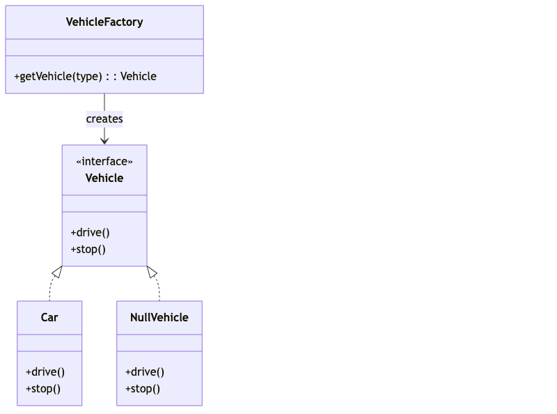

---

## ObserverPattern

### Overview (README.md)

# Observer Pattern

## What is it?
The Observer pattern defines a one-to-many dependency where when one object changes state, all dependent objects are notified automatically and updated.

## When to use it?
- A change to one object requires changing unknown number of other objects
- An object should notify others without assuming who they are
- Model real-world event systems (event listeners, MVC architecture)
- Implement pub-sub systems

## Real-world Example
**E-commerce Stock System**: When product stock changes, all observers (email notifier, SMS notifier, mobile app) are notified automatically.

## Key Benefits
✓ Loose coupling between observers and subject
✓ Dynamic subscription/unsubscription
✓ One-to-many communication
✓ Supports event-driven architecture
✓ Easy to extend with new observers

## Key Drawbacks
✗ Observer notification order is not guaranteed
✗ All observers are notified even if they don't need the update
✗ Memory leaks if observers not unsubscribed properly
✗ Debugging can be difficult (implicit dependencies)

## Easy Analogy
**Think of it like YouTube subscriptions:**
You (Observer) subscribe to a channel (Subject) → When the creator uploads a video (state change), YouTube notifies all subscribers automatically. If you unsubscribe, no more notifications.

## Implementation Notes
- **Subject**: Maintains list of observers, notifies on state change
- **Observer**: Interface with update() method
- **ConcreteObserver**: Implements update() to react to changes
- Use weak references to avoid memory leaks
- Consider thread-safety for concurrent observers

### UML / Class Diagram

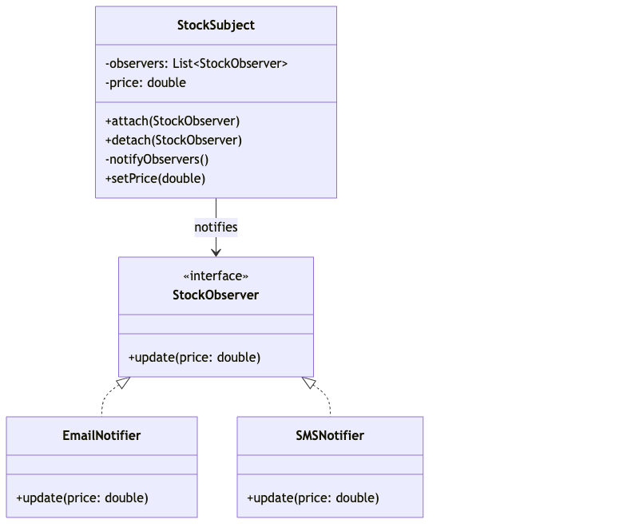

---

## chainOfResponsibilty

### Overview (README.md)

# Chain of Responsibility Pattern

## What is it?
The Chain of Responsibility pattern allows you to pass requests along a chain of handlers. Each handler decides whether to process the request or pass it to the next handler in the chain.

## When to use it?
- Multiple objects may handle a request, and the handler isn't known in advance
- You want to issue requests without specifying the receiver (e.g., logging at different levels)
- You need to dynamically configure the chain of handlers

## Real-world Example
**Logging System**: Different log levels (Debug → Info → Error) where each level handles its corresponding messages and passes others down the chain.

## Key Benefits
✓ Decouples sender from receiver
✓ Flexible chain configuration at runtime
✓ Single Responsibility: Each handler handles one responsibility
✓ Open/Closed Principle: Add new handlers without modifying existing ones

## Key Drawbacks
✗ Request may not be handled if chain is not properly configured
✗ Difficult to debug (request path not always clear)
✗ Performance overhead from passing through chain

## Easy Analogy
**Think of it like a complaint handling system in a company:**
Your complaint goes to the frontdesk → If they can't solve it, they pass to manager → If manager can't solve, they pass to director. Each person (handler) decides if they can handle it or pass it on.

## Implementation Notes
- Each handler should have a reference to the next handler
- Handler should process request and decide to pass or not
- Create chain before using it

### UML / Class Diagram

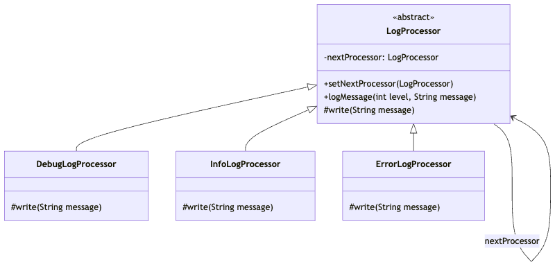

---

## mementoPattern

### Overview (README.md)

# Memento Pattern

## What is it?
The Memento pattern captures and stores an object's internal state without exposing it, allowing the object to be restored to that state later.

## When to use it?
- Implement undo/redo functionality
- Save checkpoints of an object's state
- Restore previous state without breaking encapsulation
- Maintain history of object states

## Real-world Example
**Text Editor**: Save snapshots of document at different points so users can undo/redo edits without directly accessing internal editor state.

## Key Benefits
✓ Preserves encapsulation (internal state stays hidden)
✓ Provides undo/redo functionality
✓ Doesn't violate Single Responsibility Principle
✓ Allows state restoration without side effects

## Key Drawbacks
✗ Memory overhead if too many states are stored
✗ Time overhead to create/restore snapshots
✗ More complex implementation than simple state management

## Easy Analogy
**Think of it like Google Docs version history:**
Your document (Originator) saves snapshots at certain points → Each snapshot is a Memento → Google (CareTaker) keeps all versions → You can click on any version to restore it.

## Implementation Notes
- **Originator**: Object whose state we want to save
- **Memento**: Stores snapshot of originator's state
- **CareTaker**: Manages memento objects and restoration logic
- Store mementos in a list for undo/redo operations

### UML / Class Diagram

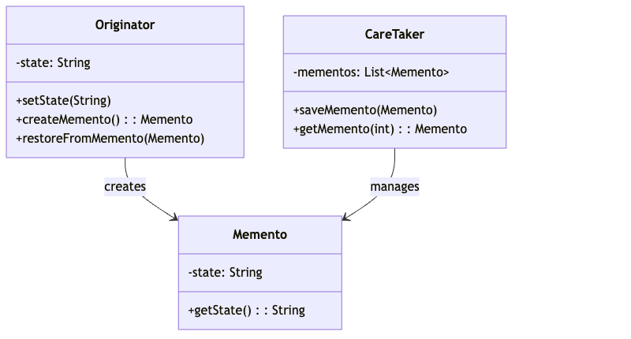

---

## objectPoolPattern

### Overview (README.md)

# Object Pool Pattern

## What is it?
The Object Pool pattern reuses objects that are expensive to create by maintaining a pool of initialized objects. When needed, objects are borrowed from the pool and returned after use.

## When to use it?
- Creating objects is expensive (database connections, threads)
- Frequent object creation/destruction causes performance issues
- Need controlled resource allocation
- Multiple threads need access to limited resources

## Real-world Example
**Database Connection Pool**: Maintain a pool of reusable database connections instead of creating new ones for each request. Connections are borrowed and returned to pool.

## Key Benefits
✓ Improved performance (avoid repeated object creation)
✓ Better resource management
✓ Thread-safe connection/resource management
✓ Reduces garbage collection overhead
✓ Predictable resource allocation

## Key Drawbacks
✗ Increased memory usage (maintaining pool)
✗ More complex implementation
✗ Synchronization overhead for thread-safety
✗ Risk of resource leaks if not managed properly

## Easy Analogy
**Think of it like a library lending system:**
Instead of making a new book for each person, the library has a pool of books. You borrow a book (getConnection) → Use it → Return it (releaseConnection). The next person can reuse the same book.

## Implementation Notes
- Maintain available and in-use lists/queues
- Implement acquire() to borrow from pool
- Implement release() to return to pool
- Handle pool exhaustion gracefully
- Ensure proper initialization of pooled objects

### UML / Class Diagram

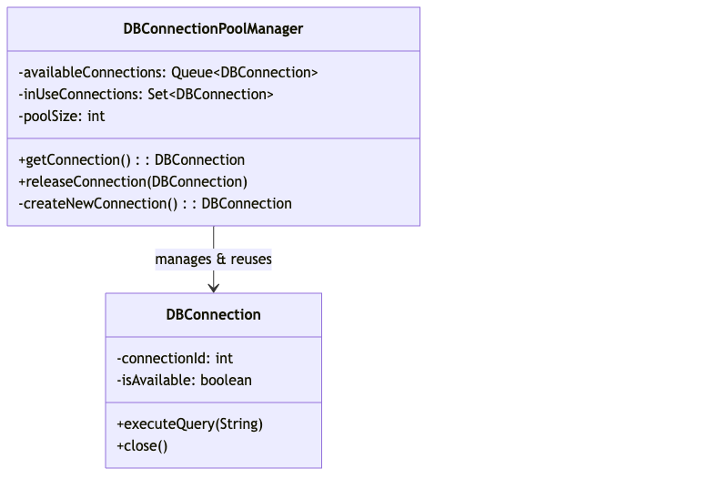

---

## statePattern

### Overview (README.md)

# State Pattern

## What is it?
The State pattern allows an object to alter its behavior when its internal state changes. The object appears to change its class when the state changes.

## When to use it?
- Object behavior depends on state and must change at runtime
- Different behaviors for different states
- State transitions are complex
- Avoid large if-else chains checking object state

## Real-world Example
**ATM Machine**: Behavior changes based on states (IdleState → CardInsertedState → PinVerifiedState). Operations allowed depend on current state.

## Key Benefits
✓ Eliminates large conditional statements
✓ Single Responsibility: Each state class handles one state
✓ Open/Closed Principle: Add new states without modifying existing ones
✓ Makes state transitions explicit
✓ Improves code readability and maintainability

## Key Drawbacks
✗ Creates many state classes (increases complexity)
✗ Overkill for simple state machines
✗ States need access to context (tight coupling possible)

## Easy Analogy
**Think of it like an ATM machine:**
IdleState → You insert card (CardInsertedState) → You enter PIN (PinVerifiedState) → You withdraw money. At each state, different operations are allowed. You can't withdraw without entering PIN.

## Implementation Notes
- **Context**: Maintains instance of concrete state
- **State**: Interface defining state-specific behavior
- **ConcreteState**: Implements behavior for specific state
- Context delegates calls to current state
- States can change context state via context reference
- Use state pattern for 3+ states or complex transitions

### UML / Class Diagram

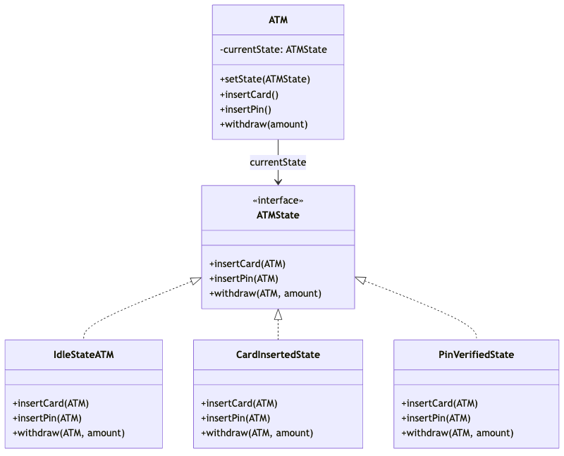

---

## strategyPattern

### Overview (README.md)

# Strategy Pattern

## What is it?
The Strategy pattern defines a family of algorithms, encapsulates each one, and makes them interchangeable. It lets the algorithm vary independently from clients that use it.

## When to use it?
- Many related classes differ only in behavior
- You need different variants of an algorithm
- Avoid conditional statements for algorithm selection
- Need to switch algorithms at runtime

## Real-world Example
**Vehicle Driving Modes**: Normal vehicle drives normally, sports vehicle can switch to sports drive mode. Different driving strategies without changing vehicle class.

## Key Benefits
✓ Eliminates conditional statements
✓ Easy to switch algorithms at runtime
✓ Single Responsibility: Each strategy handles one algorithm
✓ Open/Closed Principle: Add new strategies easily
✓ Improved testability (test each strategy independently)

## Key Drawbacks
✗ Creates many strategy classes (increases classes count)
✗ Overkill for simple algorithms
✗ Client must know about strategies
✗ Runtime overhead from dynamic dispatch

## Easy Analogy
**Think of it like choosing different routes to reach your destination:**
You have a car (Vehicle) → You can use GoogleMaps route (Strategy1) → Or Waze route (Strategy2) → Or local knowledge route (Strategy3). Same destination, different strategies. You can switch anytime.

## Implementation Notes
- **Context**: Uses strategy interface, doesn't know concrete strategy
- **Strategy**: Interface defining algorithm contract
- **ConcreteStrategy**: Implements specific algorithm
- Strategy can be set during initialization or at runtime
- Use dependency injection for strategy assignment
- Strategies should be stateless when possible

### UML / Class Diagram

---

## templatePattern

### Overview (README.md)

# Template Pattern

## What is it?
The Template Pattern defines the skeleton of an algorithm in a method, deferring some steps to subclasses. It lets subclasses redefine certain steps without changing the algorithm's structure.

## When to use it?
- Multiple classes have similar algorithm structure
- Want to avoid code duplication
- Define invariant parts in base class, variant parts in subclasses
- Invert control (Hollywood principle: "Don't call us, we'll call you")

## Real-world Example
**Payment Processing**: PaymentFlow template defines steps (validate → charge → confirm). Different payment types (ToFriend, ToMerchant) implement specific steps differently.

## Key Benefits
✓ Eliminates code duplication
✓ Single Responsibility: Separate algorithm structure from implementation
✓ Open/Closed Principle: Extend without modifying template
✓ Consistent algorithm execution
✓ Easy to maintain and extend

## Key Drawbacks
✗ Class hierarchy may become complex
✗ Violation of Liskov Substitution if subclasses don't follow contract
✗ Tight coupling between base and derived classes
✗ Limited flexibility in algorithm structure

## Easy Analogy
**Think of it like a cooking recipe:**
All recipes have basic steps: Prepare ingredients → Cook → Plate up. But within each step, the details differ. Pizza preparation is different from Biryani preparation. The template (steps) stays the same, details vary.

## Implementation Notes
- **AbstractClass**: Defines template method with algorithm skeleton
- Template method calls abstract methods (hooks)
- Subclasses override specific abstract methods
- Use final keyword on template method to prevent override
- Consider using hooks (extension points) for optional customization
- Keep base class focused on algorithm structure

### UML / Class Diagram

---

## abstractFacotoryPattern

### Overview (README.md)

# Abstract Factory Pattern

## What is it?
The Abstract Factory pattern provides an interface for creating families of related or dependent objects without specifying their concrete classes.

## When to use it?
- System needs to work with multiple families of related objects
- You want to provide a library showing only interfaces, not implementation
- Need to enforce creating products from same family
- Consistency required among products

## Real-world Example
**Car Manufacturing**: Different car types (Economy, Luxury) need matching components (Engine, Tyre). Abstract factory ensures economy cars get economy components.

## Key Benefits
✓ Isolates concrete classes from client code
✓ Easy to swap product families
✓ Enforces consistency among related products
✓ Simplifies extending to support new families
✓ Single Responsibility: Separate object creation from usage

## Key Drawbacks
✗ More complex than simple factory (multiple factory classes)
✗ Adding new product type requires modifying all factories
✗ Can be overkill for simple scenarios
✗ Indirect object creation increases complexity

## Easy Analogy
**Think of it like different restaurant chains:**
McDonalds Factory makes burgers, fries, coke → KFC Factory makes chicken, fries, coke. Both have same product categories but different implementations. Customers don't care, they just ask the factory.

## Implementation Notes
- **AbstractFactory**: Declares factory methods for creating products
- **ConcreteFactory**: Implements creation of specific product family
- **AbstractProduct**: Interface for related products
- **ConcreteProduct**: Concrete implementation of products
- Client works with abstract interfaces only
- Use when you have 2+ product families with multiple products each

### UML / Class Diagram

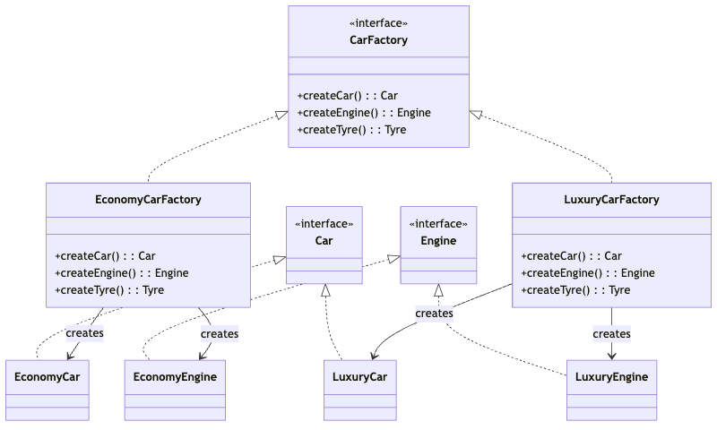

---

## abstractFactoryDesignPattern

---

## builderPattern

### Overview (README.md)

# Builder Pattern

## What is it?
The Builder pattern separates the construction of a complex object from its representation, allowing the same construction process to create different representations.

## When to use it?
- Object has many optional parameters
- Creating object with many constructor parameters (telescoping constructors problem)
- Want step-by-step construction of complex objects
- Object construction is expensive or multi-step

## Real-world Example
**Student Registration**: Build student objects with many optional fields (name, age, branch, courses). Avoid complex constructor signatures.

## Key Benefits
✓ Clear, fluent API (readable code)
✓ Handles many optional parameters elegantly
✓ Immutable objects (once built, cannot change)
✓ Single Responsibility: Separate construction from representation
✓ Flexible construction (different representations possible)

## Key Drawbacks
✗ More classes (builder class needed)
✗ More code required compared to simple constructors
✗ Slightly more memory overhead
✗ Overkill for simple objects

## Easy Analogy
**Think of it like ordering a custom pizza:**
You don't say "give me all toppings" or "nothing". You build it step by step: "Base → Cheese → Tomato → Pepperoni → Done!". Finally you get your customized pizza.

## Implementation Notes
- **Builder**: Nested static class with fluent API
- Use method chaining for readability (return this)
- Implement build() to create final object
- Provide sensible defaults for optional parameters
- Constructor should be private to force builder use
- Consider immutability after building
- Can use lombok @Builder annotation for less boilerplate

### UML / Class Diagram

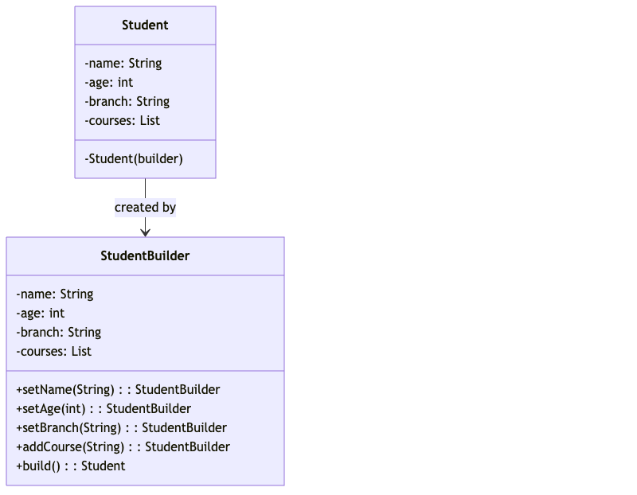

---

## factoryPattern

### Overview (README.md)

# Factory Pattern

## What is it?
The Factory pattern provides an interface for creating objects, but lets subclasses decide which class to instantiate. It creates objects without specifying the exact classes to create.

## When to use it?
- A class can't anticipate the type of objects it needs to create
- Want to delegate object creation to subclasses
- Object creation logic is complex and needs to be centralized
- Need to decouple object creation from usage

## Real-world Example
**Shape Creation**: Factory creates different shapes (Circle, Rectangle) based on input type. Client doesn't need to know concrete shape classes.

## Key Benefits
✓ Decouples client from concrete classes
✓ Centralizes object creation logic
✓ Easy to add new object types
✓ Follows Open/Closed Principle
✓ Simplifies client code

## Key Drawbacks
✗ More classes needed (factory + concrete classes)
✗ Can be overkill for simple object creation
✗ Indirection makes code harder to follow
✗ Over-abstraction in simple scenarios

## Easy Analogy
**Think of it like a car dealership:**
You go to the dealership (Factory) and ask for a "Honda Civic" (type). The dealership gives you the right car without you worrying how it's built. You just know the interface: "it has 4 wheels, can start and stop".

## Implementation Notes
- **Creator/Factory**: Interface with factory method
- **ConcreteCreator**: Implements factory method for specific type
- **Product**: Interface for created objects
- **ConcreteProduct**: Concrete implementation
- Use enums or string identifiers for object type selection
- Can be static method factory instead of inheritance-based
- Ensure all created objects conform to product interface

### UML / Class Diagram

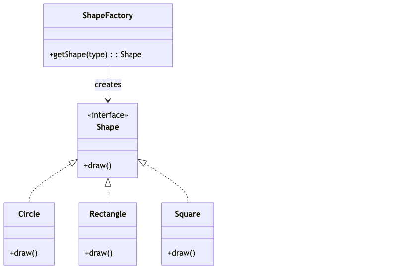

---

## prototypePattern

### Overview (README.md)

# Prototype Pattern

## What is it?
The Prototype pattern creates new objects by copying an existing object (prototype) rather than creating from scratch. Useful when object creation is expensive.

## When to use it?
- Object creation is expensive or slow
- Need to avoid subclassing for object creation
- Want to create clones of objects with different states
- Need to decouple object creation from concrete classes

## Real-world Example
**Network Connection Cloning**: Clone existing network connections (shallow/deep cloning) with different configurations instead of creating from scratch.

## Key Benefits
✓ Faster object creation (copy existing object)
✓ Avoids expensive initialization
✓ Reduces memory usage in some cases
✓ Decouples client from concrete classes
✓ Flexible cloning strategies

## Key Drawbacks
✗ Shallow vs deep cloning complexity
✗ Clone method implementation required for all classes
✗ Circular references complicate deep cloning
✗ Performance overhead from copying large objects

## Easy Analogy
**Think of it like photocopying documents:**
You have an original document → You make a photocopy (shallow clone) → But if the original has attachments, the copy references the same attachments. With deep copy, you also copy the attachments.

## Implementation Notes
- Implement Cloneable interface
- Override clone() method to create copy
- **Shallow Clone**: Only copy reference fields (uses default clone)
- **Deep Clone**: Create new instances of referenced objects
- Use copy constructor alternative to clone()
- Be careful with mutable fields (may need deep clone)
- Handle CloneNotSupportedException

### UML / Class Diagram

---

## singletonDesignPattern

### Overview (README.md)

# Singleton Pattern

## What is it?
The Singleton pattern restricts the instantiation of a class to a single object and provides a global point of access to that instance.

## When to use it?
- Only one instance of a class should exist (e.g., database connection, logger)
- Need global access to the instance
- Ensure instance is created only once
- Control access to shared resource

## Real-world Example
**Database Connection**: Only one DB connection instance should exist for the entire application. Singleton ensures single instance and global access.

## Key Benefits
✓ Ensures single instance
✓ Global point of access
✓ Lazy initialization possible
✓ Thread-safe implementation available
✓ Prevents multiple instantiation

## Key Drawbacks
✗ Difficult to test (global state)
✗ Hidden dependencies (singleton dependency not clear)
✗ Violates Single Responsibility Principle
✗ Not thread-safe in all implementations
✗ Makes code less flexible

## Easy Analogy
**Think of it like a country's president:**
There's only ONE president at a time. When you need to talk to the president, you ask for "the president" not "create a new president". Everyone gets the same president instance.

## Implementation Notes
- Private constructor to prevent instantiation
- Static instance variable
- Public static getInstance() method
- **Eager Initialization**: Create instance at class loading
- **Lazy Initialization**: Create instance on first access
- **Thread-safe**: Use synchronized block or double-checked locking
- Consider using Enums for thread-safe singleton
- Implement Serializable/Cloneable carefully to maintain singleton

### UML / Class Diagram

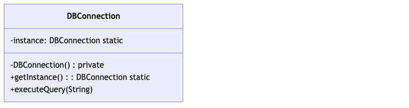

---

## AdapterDesignPattern

### Overview (README.md)

# Adapter Pattern

## What is it?
The Adapter pattern converts the interface of a class into another interface clients expect. It allows incompatible objects to collaborate.

## When to use it?
- Have incompatible interfaces that need to work together
- Integrate third-party libraries with different interfaces
- Want to reuse existing class with incompatible interface
- Create bridge between old and new code

## Real-world Example
**Weight Machine Adapter**: Weight machine returns weight in different formats. Adapter converts to pounds/kg format that clients expect.

## Key Benefits
✓ Allows collaboration between incompatible objects
✓ Improves code reusability
✓ Follows Single Responsibility Principle
✓ Follows Open/Closed Principle
✓ Helps integrate legacy code

## Key Drawbacks
✗ Added complexity with extra adapter class
✗ Can hide design problems in original interfaces
✗ May reduce performance due to indirection
✗ Overkill for simple interface changes

## Easy Analogy
**Think of it like an electrical adapter:**
You have a device (WeightMachine) that outputs in kg, but your client needs it in pounds. The adapter converts kg to pounds without changing the original device.

## Implementation Notes
- **Target**: Interface clients expect
- **Adaptee**: Existing interface that needs adaptation
- **Adapter**: Converts adaptee interface to target interface
- **Two types**: Class adapter (inheritance) and object adapter (composition)
- Object adapter is preferred (more flexible)
- Keep adapter simple (avoid complex logic)
- Consider whether modification of adaptee is possible

### UML / Class Diagram

---

## DecoratorDesign

### Overview (README.md)

# Decorator Pattern

## What is it?
The Decorator pattern attaches additional responsibilities to an object dynamically. It provides a flexible alternative to subclassing for extending functionality.

## When to use it?
- Add responsibilities to individual objects without affecting others
- Subclassing would create too many classes
- Need to combine multiple behaviors dynamically
- Avoid "explosion" of subclasses

## Real-world Example
**Ice Cream Shop**: Base ice cream (Vanilla, Chocolate) can be decorated with toppings (ChocolateSyrup, ChocoChips). Each decorator adds features.

## Key Benefits
✓ More flexible than subclassing
✓ Add/remove responsibilities at runtime
✓ Combine behaviors dynamically
✓ Single Responsibility: Each decorator has one responsibility
✓ Avoids subclass explosion

## Key Drawbacks
✗ Many small classes (decorators)
✗ Complex object composition
✗ Decoration order matters (may affect functionality)
✗ Can be overkill for simple additions

## Easy Analogy
**Think of it like customizing a shirt:**
Basic shirt → Add sleeves (decorator) → Add buttons (another decorator) → Add collar (another decorator). Each decorator adds functionality without changing the original shirt.

## Implementation Notes
- **Component**: Interface for decorators and concrete objects
- **ConcreteComponent**: Original object being decorated
- **Decorator**: Abstract class maintaining reference to component
- **ConcreteDecorator**: Adds specific responsibility
- Decorator wraps component and delegates calls
- Can wrap decorator with another decorator
- Maintain same interface as component
- Watch order of decoration (may affect results)

### UML / Class Diagram

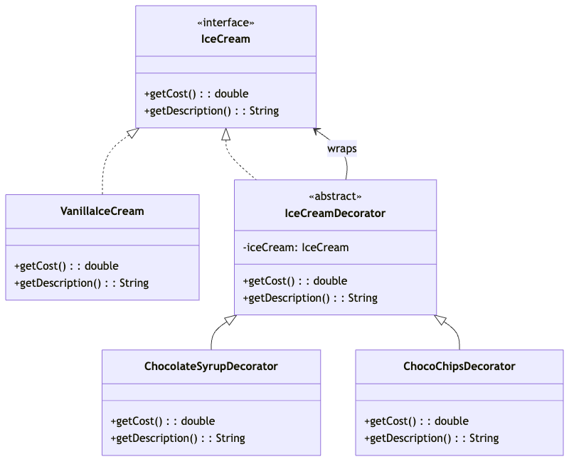

---

## ProxyPattern

### Overview (README.md)

# Proxy Pattern

## What is it?
The Proxy pattern provides a surrogate or placeholder for another object to control access to it. Proxy acts on behalf of the real object.

## When to use it?
- Defer expensive object creation (lazy initialization)
- Control access to sensitive objects
- Log access to objects
- Cache results of expensive operations
- Restrict operations on objects

## Real-world Example
**Employee Data Cache Proxy**: Real expensive employee data fetches from DB. Proxy caches data in Redis, returning cached results when available.

## Key Benefits
✓ Control access to objects
✓ Lazy initialization (create object only when needed)
✓ Add logging/caching without modifying original
✓ Follows Single Responsibility Principle
✓ Transparent to client code

## Key Drawbacks
✗ Added complexity with extra proxy class
✗ Performance overhead from proxy indirection
✗ Response time slightly increased
✗ Overkill for simple objects

## Easy Analogy
**Think of it like a personal assistant:**
You (Real Subject) are busy. Your assistant (Proxy) handles your calls → If someone asks your salary, assistant checks notes (cache) → If not there, asks you. No one directly bothers you.

## Implementation Notes
- **Subject**: Interface for proxy and real object
- **RealSubject**: Actual object being proxied
- **Proxy**: Manages access to real subject
- Proxy implements same interface as subject
- Can control access, cache, or defer creation
- **Types**: Protection proxy, virtual proxy, cache proxy, remote proxy
- Maintain reference to real subject
- Delegate calls to real subject after proxy logic

### UML / Class Diagram

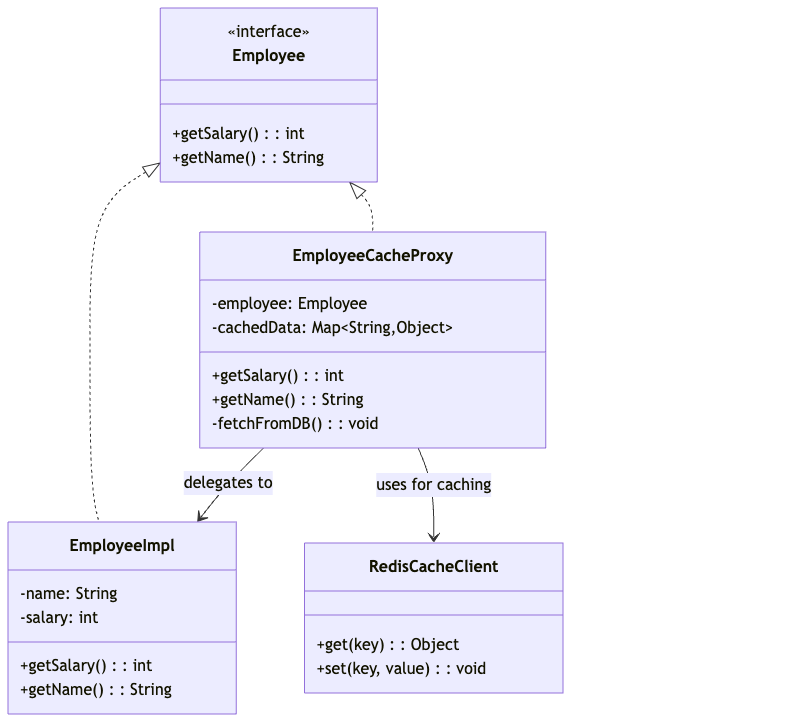

---

## bridgePattern

### Overview (README.md)

# Bridge Pattern

## What is it?
The Bridge pattern decouples an abstraction from its implementation so that the two can vary independently. It bridges the gap between abstraction and implementation.

## When to use it?
- Abstraction and implementation should be independent
- Changes in implementation shouldn't affect client code
- Want to avoid permanent binding between abstraction and implementation
- Multiple implementations for same abstraction

## Real-world Example
**Living Things Breathing**: Different living things (Dog, Fish, Tree) have different breathing mechanisms (Lungs, Gills, Photosynthesis). Bridge separates living things from breathing processes.

## Key Benefits
✓ Decouples abstraction from implementation
✓ Implementation can change without affecting clients
✓ Avoid permanent binding between abstraction and implementation
✓ Improves code maintainability
✓ Follows Open/Closed Principle

## Key Drawbacks
✗ More complex design (more classes needed)
✗ Overkill for simple hierarchies
✗ Increased indirection affects performance
✗ Can overcomplicate simple designs

## Easy Analogy
**Think of it like a car and its engine types:**
A car is abstraction (LivingThing) → It can be Sedan, SUV (Dog, Fish) → Engine type is implementation (Breathing) → Can be Petrol, Diesel (Lungs, Gills). You can mix any car with any engine.

## Implementation Notes
- **Abstraction**: Defines high-level interface
- **RefinedAbstraction**: Extends abstraction
- **Implementor**: Defines lower-level interface
- **ConcreteImplementor**: Implements specific behavior
- Abstraction should contain reference to Implementor
- Use composition instead of inheritance
- Separate abstraction hierarchy from implementation hierarchy

### UML / Class Diagram

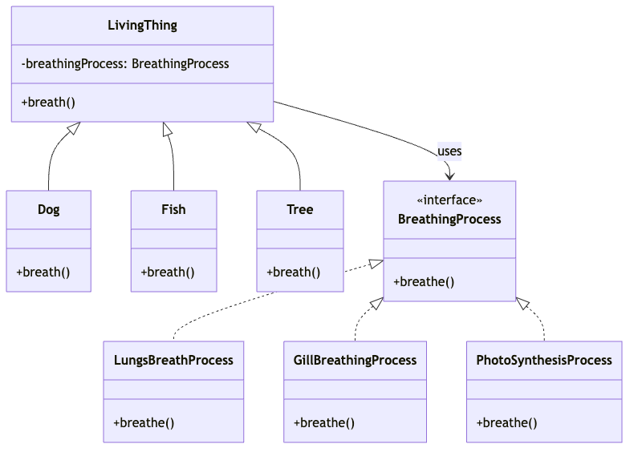

---

## compositePattern

### Overview (README.md)

# Composite Pattern

## What is it?
The Composite pattern composes objects into tree structures to represent part-whole hierarchies. It allows clients to treat individual objects and compositions uniformly.

## When to use it?
- Represent hierarchical structures (trees)
- Clients should treat individual and composite objects the same way
- Part-whole relationships need to be represented
- File system or menu structures

## Real-world Example
**File System**: Files and directories form a tree. Both can have operations like get size, copy. Composite pattern treats them uniformly.

## Key Benefits
✓ Simplifies client code (same treatment for leaf and composite)
✓ Flexible tree structures (easy to add/remove nodes)
✓ Follows Single Responsibility Principle
✓ Follows Open/Closed Principle
✓ Recursive composition is natural

## Key Drawbacks
✗ May force inappropriate operations on leaves
✗ Less type safety (both leaf and composite look same)
✗ Complexity increases with tree depth
✗ Performance issues with deep trees

## Easy Analogy
**Think of it like a folder structure on your computer:**
Folders contain files and other folders → You can ask any folder/file "what's your size?" → A folder calculates size by adding all children's sizes. Same operation, different implementations.

## Implementation Notes
- **Component**: Declares common operations
- **Leaf**: Represents leaf objects (no children)
- **Composite**: Represents composite objects (has children)
- Composite implements add/remove/get children methods
- Both leaf and composite implement component operations
- Watch out for inappropriate operations on leaves
- Consider empty checks for operations on leaves

### UML / Class Diagram

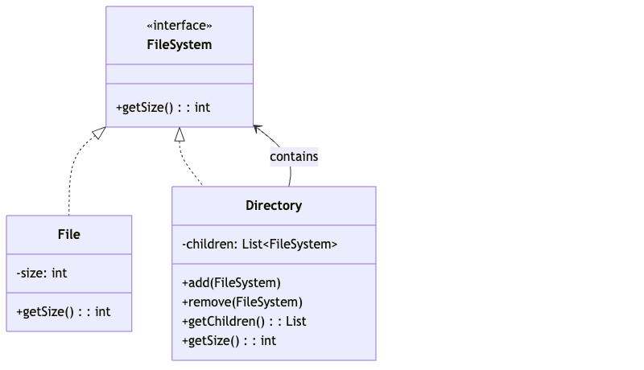

---

## flyweightPattern

### Overview (README.md)

# Flyweight Pattern

## What is it?
The Flyweight pattern uses sharing to support large numbers of fine-grained objects efficiently by sharing common state between multiple objects.

## When to use it?
- Application uses large number of similar objects
- Memory usage is a concern
- Intrinsic state can be shared between objects
- Many objects with same properties

## Real-world Example
**Robot Game**: Game has thousands of robots. Instead of creating separate objects, share intrinsic state (sprite type) and keep extrinsic state (position) separate.

## Key Benefits
✓ Significantly reduces memory usage
✓ Improves application performance
✓ Centralizes management of shared state
✓ Good for large-scale applications
✓ Transparent to client code

## Key Drawbacks
✗ Increased complexity in code
✗ Thread-safety concerns (shared objects)
✗ Performance overhead from object lookup
✗ Intrinsic/extrinsic state separation not always clear

## Easy Analogy
**Think of it like a multiplayer game with 10,000 soldiers:**
All soldiers have the same armor type (shared/intrinsic) but different positions (unique/extrinsic). Instead of creating 10,000 objects, create 1 shared soldier object, reuse it with different positions.

## Implementation Notes
- **Flyweight**: Interface for shared and unique states
- **ConcreteFlyweight**: Stores intrinsic state (shared)
- **FlyweightFactory**: Creates and manages flyweight objects
- **Client**: Maintains extrinsic state
- Separate intrinsic (shared) from extrinsic (unique) state
- Use factory pattern to create/retrieve flyweights
- Ensure flyweight objects are immutable
- Consider thread-safety for shared objects
- Useful when you have thousands of similar objects

### UML / Class Diagram

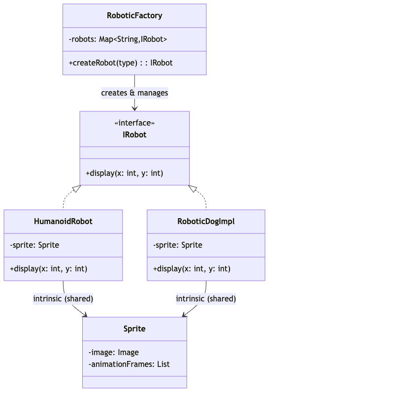

