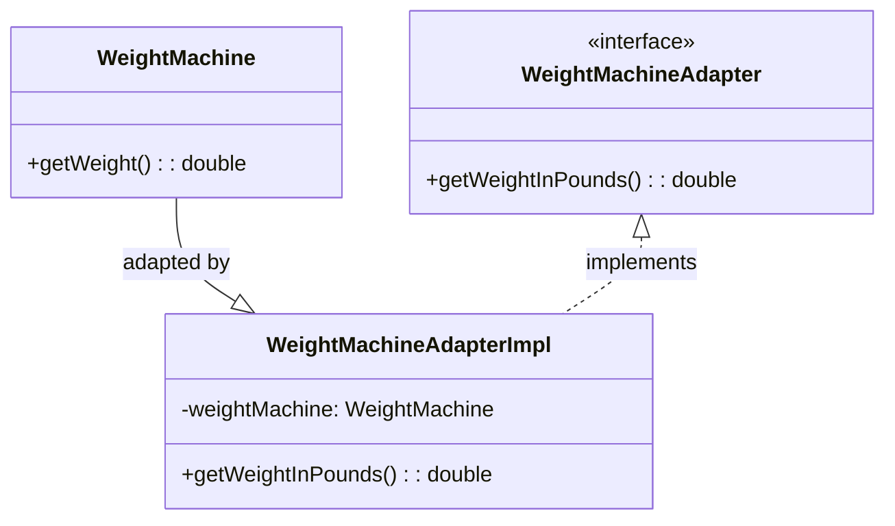

# Adapter - Class Diagram



## Class Relationships

| Class | Responsibility | Depends On |
|-------|---|---|
| **WeightMachine** | Adaptee - existing class with incompatible interface | None |
| **WeightMachineAdapter** | Target interface - interface client expects | None |
| **WeightMachineAdapterImpl** | Adapter - converts adaptee to target interface | Has WeightMachine, implements Adapter |

## How to Code This Pattern

### Object Adapter (Composition - Recommended)
```java
class WeightMachineAdapterImpl implements WeightMachineAdapter {
    private WeightMachine weightMachine;
    
    public WeightMachineAdapterImpl(WeightMachine wm) {
        # Adapter - Class Diagram

        ```mermaid
        classDiagram
            class WeightMachine {
                +getWeight(): double
            }

            class WeightReader {
                <<interface>>
                +getWeightInPounds(): double
            }

            class WeightMachineAdapterImpl {
                -weightMachine: WeightMachine
                +WeightMachineAdapterImpl(wm: WeightMachine)
                +getWeightInPounds(): double
            }

            %% Relationships
            WeightMachineAdapterImpl --> WeightMachine : uses
            WeightReader <|.. WeightMachineAdapterImpl

        ```

        ## Class Relationships

        | Class | Responsibility | Depends On |
        |-------|---|---|
        | **WeightMachine** | Adaptee — existing class providing weight in its own units | None |
        | **WeightReader** | Target interface — what clients expect (weight in pounds) | None |
        | **WeightMachineAdapterImpl** | Adapter (object adapter) — converts WeightMachine to WeightReader | Uses `WeightMachine`, implements `WeightReader` |

        ## Plain Explanation

        The client expects `WeightReader` (method `getWeightInPounds()`), but `WeightMachine` only provides `getWeight()`. The adapter (`WeightMachineAdapterImpl`) holds a `WeightMachine` and converts its result into the expected format.

        ## How to Code This Pattern (Minimal)

        ### Object Adapter (Composition — recommended)
        ```java
        // Target
        public interface WeightReader {
            double getWeightInPounds();
        }

        // Adaptee
        public class WeightMachine {
            public double getWeight() { return 50.0; /* kg */ }
        }

        // Adapter
        public class WeightMachineAdapterImpl implements WeightReader {
            private final WeightMachine weightMachine;

            public WeightMachineAdapterImpl(WeightMachine wm) { this.weightMachine = wm; }

            @Override
            public double getWeightInPounds() {
                return weightMachine.getWeight() * 2.20462; // kg -> lb
            }
        }
        ```

        ### Class Adapter (Inheritance — less flexible)
        ```java
        public class WeightMachineAdapter extends WeightMachine implements WeightReader {
            @Override
            public double getWeightInPounds() {
                return getWeight() * 2.20462;
            }
        }
        ```

        ## Key Points

        - Use object adapter (composition) when you can: it works with final/adapted classes and is more flexible.
        - Use class adapter (inheritance) only when you must inherit and the adaptee's interface is compatible with inheritance.
        - Adapter focuses on converting interfaces, not changing behaviour.
