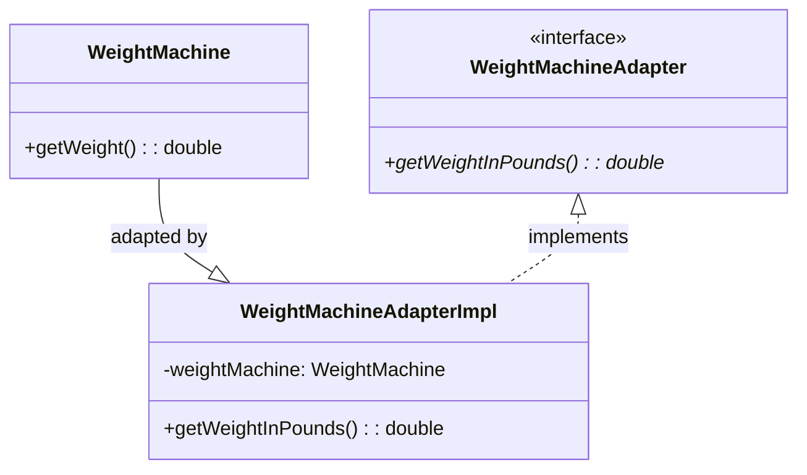

# Adapter - Class Diagram



## Class Relationships

| Class | Responsibility | Depends On |
|-------|---|---|
| **WeightMachine** | Adaptee - existing class with incompatible interface | None |
| **WeightMachineAdapter** | Target interface - interface client expects | None |
| **WeightMachineAdapterImpl** | Adapter - converts adaptee to target interface | Has WeightMachine, implements Adapter |

## How to Code This Pattern

### Object Adapter (Composition - Recommended)
```java
class WeightMachineAdapterImpl implements WeightMachineAdapter {
    private WeightMachine weightMachine;
    
    public WeightMachineAdapterImpl(WeightMachine wm) {
        this.weightMachine = wm;
    }
    
    @Override
    public double getWeightInPounds() {
        return weightMachine.getWeight() * 2.20462;
    }
}
```

### Class Adapter (Inheritance)
```java
class WeightMachineAdapter extends WeightMachine implements WeightMachineAdapter {
    @Override
    public double getWeightInPounds() {
        return getWeight() * 2.20462;
    }
}
```

## Key Points

- **Adaptee**: Class with incompatible interface (existing class)
- **Adapter**: New class converting adaptee to target
- **Target**: Interface client expects
- **Composition Better**: More flexible than inheritance
