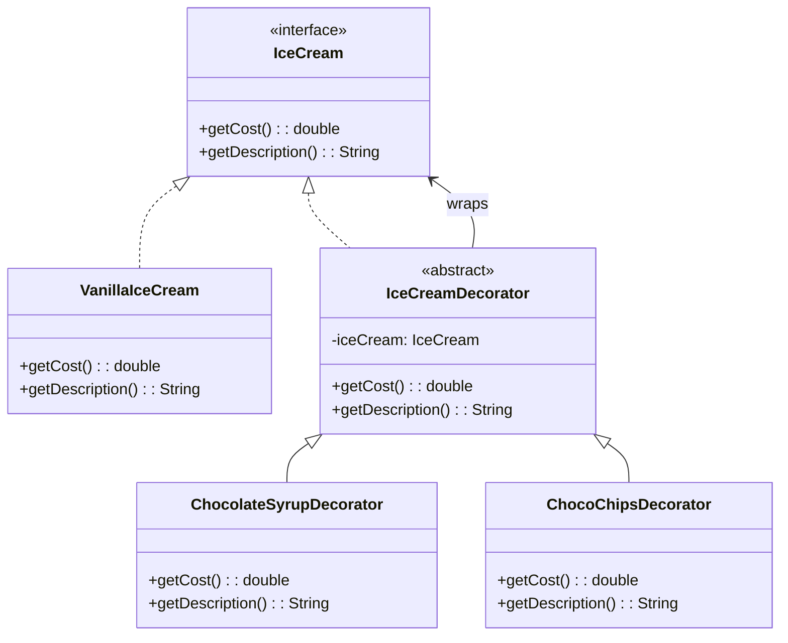

# Decorator - Class Diagram



## Class Relationships

| Class | Responsibility | Depends On |
|-------|---|---|
| **IceCream** | Component interface - defines ice cream operations | None |
| **VanillaIceCream** | Concrete component - base ice cream | Implements IceCream |
| **IceCreamDecorator** | Abstract decorator - wraps ice cream and adds features | Has IceCream, implements IceCream |
| **ChocolateSyrupDecorator** | Concrete decorator - adds chocolate syrup | Extends IceCreamDecorator |
| **ChocoChipsDecorator** | Concrete decorator - adds choco chips | Extends IceCreamDecorator |

## How to Code This Pattern

1. **Create Component Interface**: `IceCream` with `getCost()` and `getDescription()`
2. **Create Concrete Component**: `VanillaIceCream` implements interface
3. **Create Abstract Decorator**: Implements interface, wraps component
4. **Decorator holds Component**: `IceCreamDecorator` has `IceCream` reference
5. **Decorator delegates**: Call wrapped component's methods first, then add own behavior
6. **Create Concrete Decorators**: Each adds specific feature
7. **Stack Decorators**: Can wrap decorator with another decorator

## Example Usage
```java
IceCream iceCream = new VanillaIceCream();  // cost: 30
iceCream = new ChocolateSyrupDecorator(iceCream);  // cost: 30 + 15 = 45
iceCream = new ChocoChipsDecorator(iceCream);  // cost: 45 + 10 = 55
```

## Key Points

- **Wrapper Pattern**: Decorators wrap components
- **Same Interface**: Decorator implements same interface as component
- **Recursive Composition**: Can nest decorators
- **Runtime Addition**: Add features at runtime
