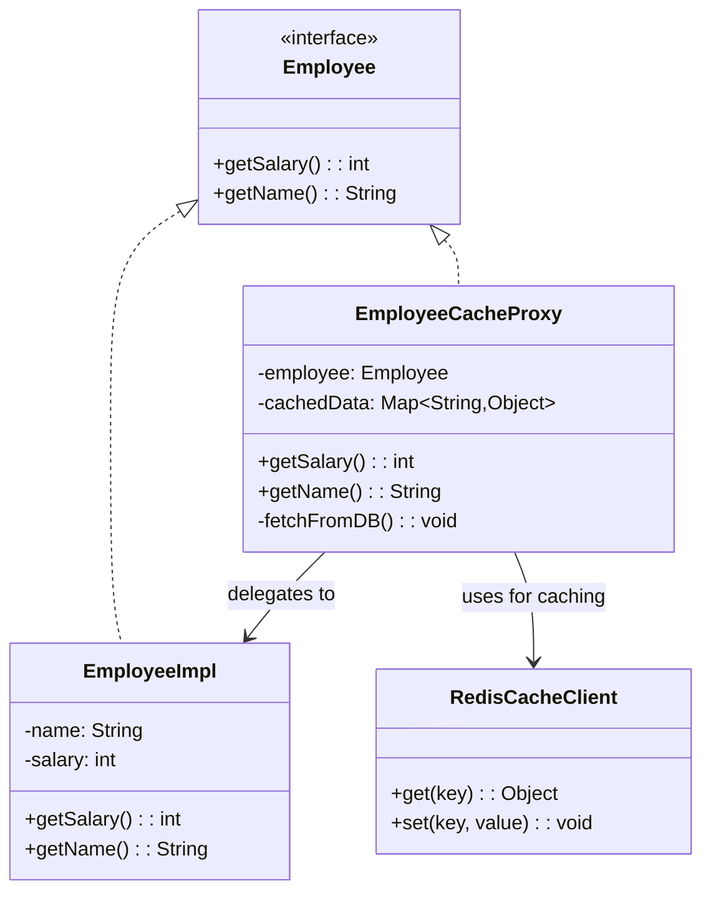

# Proxy - Class Diagram



## Class Relationships

| Class | Responsibility | Depends On |
|-------|---|---|
| **Employee** | Subject interface - defines operations | None |
| **EmployeeImpl** | Real subject - actual expensive object | Implements Employee |
| **EmployeeCacheProxy** | Proxy - controls access, adds caching | Has Employee, uses cache |
| **RedisCacheClient** | External cache - stores cached data | None |

## How to Code This Pattern

1. **Create Subject Interface**: `Employee` with `getSalary()`, `getName()`

2. **Create Real Subject**: `EmployeeImpl` does expensive DB operations

3. **Create Proxy**: Implements same interface
```java
class EmployeeCacheProxy implements Employee {
    private Employee employee;
    private Map<String, Object> cache;
    
    public EmployeeCacheProxy(Employee emp) {
        this.employee = emp;
        this.cache = new HashMap<>();
    }
    
    @Override
    public int getSalary() {
        if (cache.containsKey("salary")) {
            return (int) cache.get("salary");
        }
        int salary = employee.getSalary();
        cache.put("salary", salary);
        return salary;
    }
}
```

4. **Proxy Controls Access**:
   - Cache before delegating
   - Lazy load real object
   - Log/track access
   - Restrict access

5. **Client uses Proxy**: `Employee emp = new EmployeeCacheProxy(...)`

## Proxy Types

| Type | Purpose |
|------|---------|
| **Protection Proxy** | Control access (security) |
| **Virtual Proxy** | Lazy initialization of expensive objects |
| **Cache Proxy** | Cache expensive operations |
| **Remote Proxy** | Represent remote object |

## Key Points

- **Same Interface**: Proxy implements same interface as real object
- **Transparent**: Client doesn't know it's using proxy
- **Add Behavior**: Before/after delegating to real object
- **Control Access**: Decide when and how to delegate
