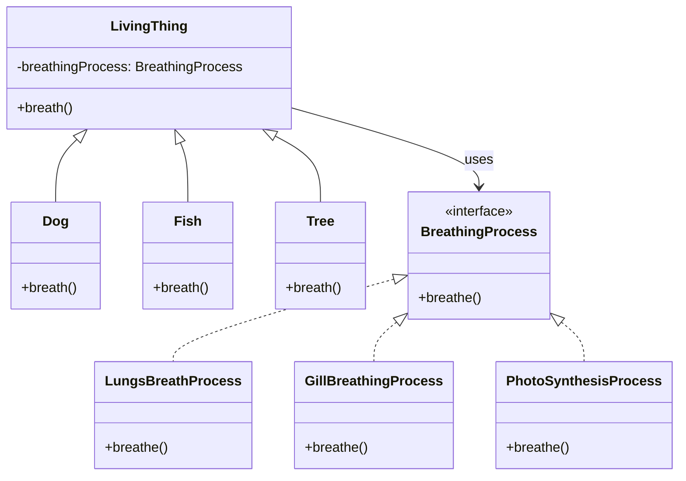

# Bridge - Class Diagram

## Class Relationships

| Class | Responsibility | Depends On |
|-------|---|---|
| **LivingThing** | Abstraction - high-level interface | Uses BreathingProcess |
| **Dog/Fish/Tree** | Refined abstractions | Extend LivingThing |
| **BreathingProcess** | Implementor interface - low-level interface | None |
| **Lungs/Gill/Photosynthesis** | Concrete implementors | Implement BreathingProcess |

## How to Code This Pattern

1. **Separate Hierarchies**: Keep abstraction and implementation in separate hierarchies
2. **Abstraction contains Implementor**: `LivingThing` has reference to `BreathingProcess`
3. **Concrete Abstractions**: `Dog`, `Fish`, `Tree` extend abstraction
4. **Concrete Implementors**: Implement the implementor interface
5. **Combine dynamically**: `Dog` can use any `BreathingProcess`
6. **Avoid Explosion**: Without bridge, would have Dog-Lungs, Dog-Gills, etc. classes

## Key Points

- **Bridge**: Separate abstraction from implementation
- **Two Hierarchies**: One for abstraction, one for implementation
- **Composition**: Abstraction uses composition with implementor
- **Flexibility**: Change implementation independently from abstraction
