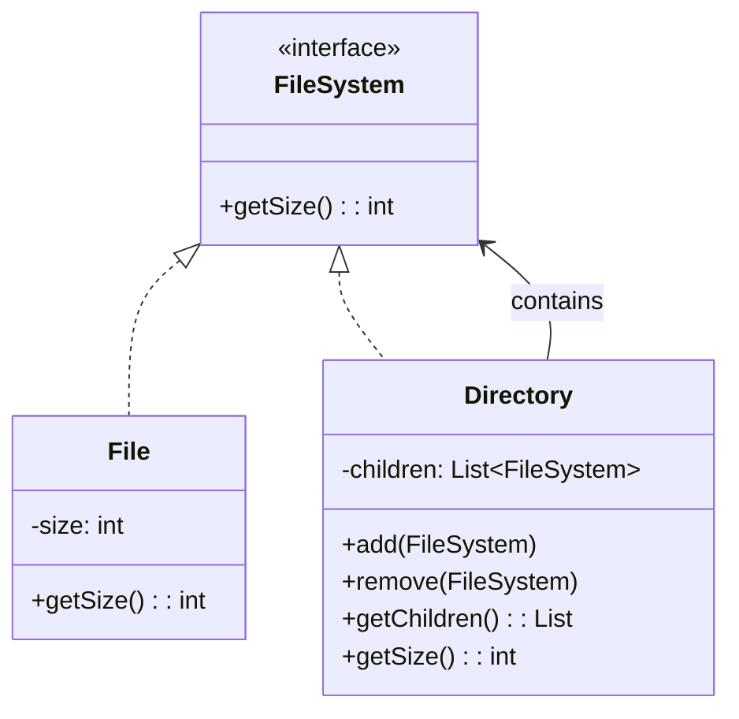

# Composite - Class Diagram

## Class Relationships

| Class | Responsibility | Depends On |
|-------|---|---|
| **FileSystem** | Component interface - defines common operations | None |
| **File** | Leaf - represents file with no children | Implements FileSystem |
| **Directory** | Composite - contains FileSystem objects (files/folders) | Implements FileSystem, contains FileSystem |

## How to Code This Pattern

1. **Create Component Interface**: Define `getSize()`, `add()`, `remove()`
2. **Create Leaf Class**: `File` implements interface, `getSize()` returns file size
3. **Create Composite Class**: `Directory` implements interface
4. **Maintain Children**: Directory has list of FileSystem objects
5. **Add/Remove Methods**: Composite implements add() and remove()
6. **Recursive Operations**: `Directory.getSize()` sums all children's sizes
7. **Uniform Treatment**: Both File and Directory are treated as FileSystem

## Key Points

- **Leaf**: File - no children, performs actual work
- **Composite**: Directory - can have children
- **Recursive**: Operations work recursively through tree
- **Uniform**: Client treats both File and Directory same way
