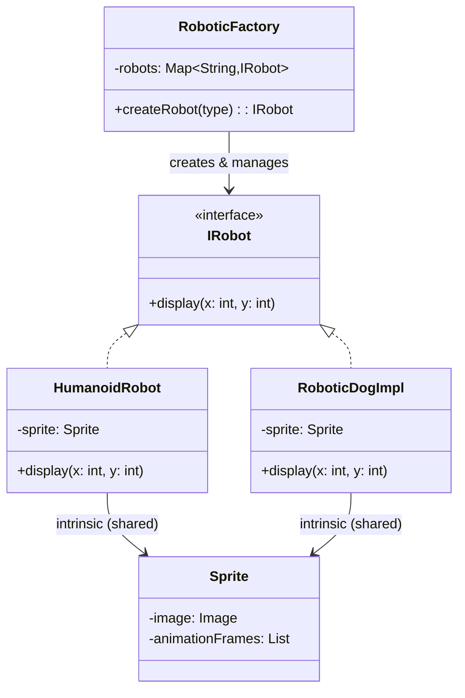

# Flyweight - Class Diagram



## Class Relationships

| Class | Responsibility | Depends On |
|-------|---|---|
| **IRobot** | Flyweight interface - defines robot display method | None |
| **HumanoidRobot/RoboticDogImpl** | Concrete flyweights - store intrinsic state (sprite) | Implements IRobot, has shared Sprite |
| **RoboticFactory** | Flyweight factory - creates and caches flyweights | Creates and manages IRobot |
| **Sprite** | Intrinsic state - shared across many robots (immutable) | None |

## How to Code This Pattern

1. **Separate Intrinsic/Extrinsic State**:
   - **Intrinsic**: Sprite (shared) - stored in flyweight
   - **Extrinsic**: Position x, y (unique) - passed as parameter

2. **Create Flyweight Interface**: `IRobot` with `display(x, y)`

3. **Create Concrete Flyweights**: Store only intrinsic state

4. **Create Factory**: Cache and reuse flyweights
```java
class RoboticFactory {
    private Map<String, IRobot> robots = new HashMap<>();
    
    public IRobot createRobot(String type) {
        if (!robots.containsKey(type)) {
            robots.put(type, new HumanoidRobot(new Sprite(...)));
        }
        return robots.get(type);
    }
}
```

5. **Client provides extrinsic state**: `robot.display(100, 200)`

## Key Points

- **Shared State**: Intrinsic state shared across many objects
- **Unique State**: Extrinsic state kept in client
- **Memory Optimization**: 10,000 robots, 1 sprite = huge savings
- **Immutable**: Flyweight objects must be immutable
- **Factory**: Factory manages caching and reuse
