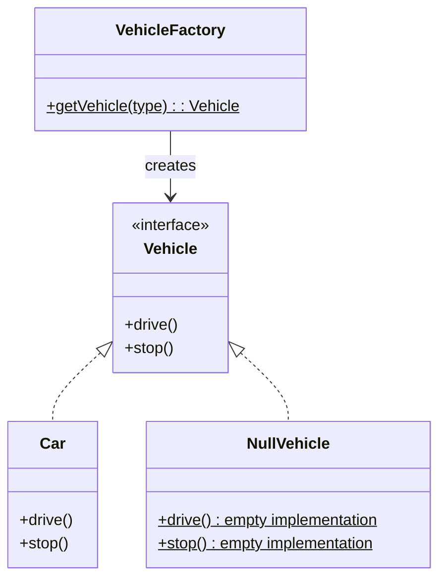

# Null Object - Class Diagram

## Class Relationships

| Class | Responsibility | Depends On |
|-------|---|---|
| **Vehicle** | Interface defining vehicle behavior (contract) | None |
| **Car** | Real implementation of vehicle | Implements Vehicle |
| **NullVehicle** | Null object - implements interface but does nothing | Implements Vehicle |
| **VehicleFactory** | Creates vehicles or NullVehicle instead of returning null | Returns Vehicle |

## How to Code This Pattern

1. **Define Interface**: Create `Vehicle` interface
2. **Create Real Class**: `Car` implements `Vehicle` with actual behavior
3. **Create Null Class**: `NullVehicle` implements `Vehicle` with empty methods
4. **Update Factory**: Return `NullVehicle` instead of `null`
5. **No Null Checks**: Client code doesn't need to check for null
