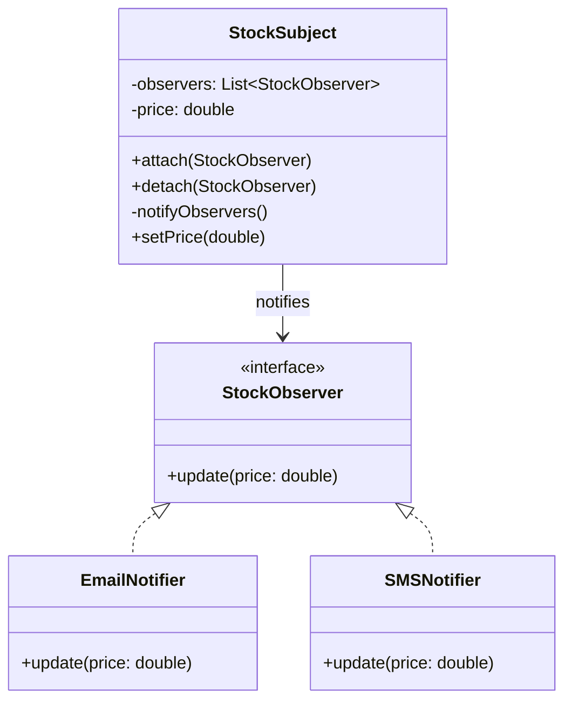

# Observer - Class Diagram

## Class Relationships

| Class | Responsibility | Depends On |
|-------|---|---|
| **StockObserver** | Interface for observers receiving notifications | None |
| **EmailNotifier** | Concrete observer - sends email when notified | Implements StockObserver |
| **SMSNotifier** | Concrete observer - sends SMS when notified | Implements StockObserver |
| **StockSubject** | Subject/Observable - notifies all observers on state change | Maintains list of StockObserver |

## How to Code This Pattern

1. **Create Observer Interface**: Define `update()` method signature
2. **Create Concrete Observers**: `EmailNotifier`, `SMSNotifier` implement `update()`
3. **Create Subject**: Maintain list of observers
4. **Implement attach()**: Add observer to list
5. **Implement detach()**: Remove observer from list
6. **Implement notifyObservers()**: Call `update()` on all observers
7. **On State Change**: Call `notifyObservers()` when data changes
