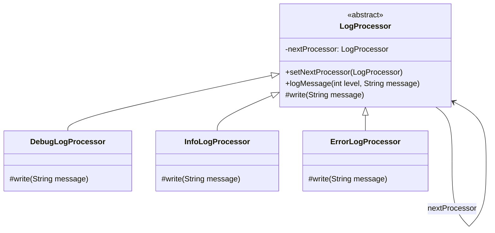

# Chain of Responsibility - Class Diagram

## Class Relationships

| Class | Responsibility | Depends On |
|-------|---|---|
| **LogProcessor** | Abstract base - defines chain structure and template for logging | nextProcessor (self-reference) |
| **DebugLogProcessor** | Handles debug-level log messages | LogProcessor (extends) |
| **InfoLogProcessor** | Handles info-level log messages | LogProcessor (extends) |
| **ErrorLogProcessor** | Handles error-level log messages | LogProcessor (extends) |

## How to Code This Pattern

1. **Create Abstract Processor**: Define `LogProcessor` with next processor reference
2. **Implement Processors**: Each concrete class handles specific log level
3. **Build Chain**: Connect processors in order (Debug → Info → Error)
4. **Send Request**: Processor either handles it or passes to next
