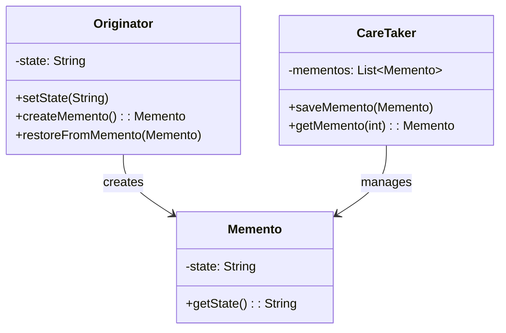

# Memento - Class Diagram

## Class Relationships

| Class | Responsibility | Depends On |
|-------|---|---|
| **Originator** | Creates memento snapshots of its state, can restore from memento | Creates Memento |
| **Memento** | Immutable snapshot of originator's state at a point in time | None (value object) |
| **CareTaker** | Manages collection of mementos, provides history management | Stores/retrieves Memento |

## How to Code This Pattern

1. **Create Originator**: Add `createMemento()` and `restoreFromMemento()` methods
2. **Create Memento**: Immutable class storing state snapshot
3. **Create CareTaker**: Maintain list of mementos (undo/redo stack)
4. **Save State**: Call `createMemento()` before changes
5. **Restore State**: Call `restoreFromMemento()` to go back
