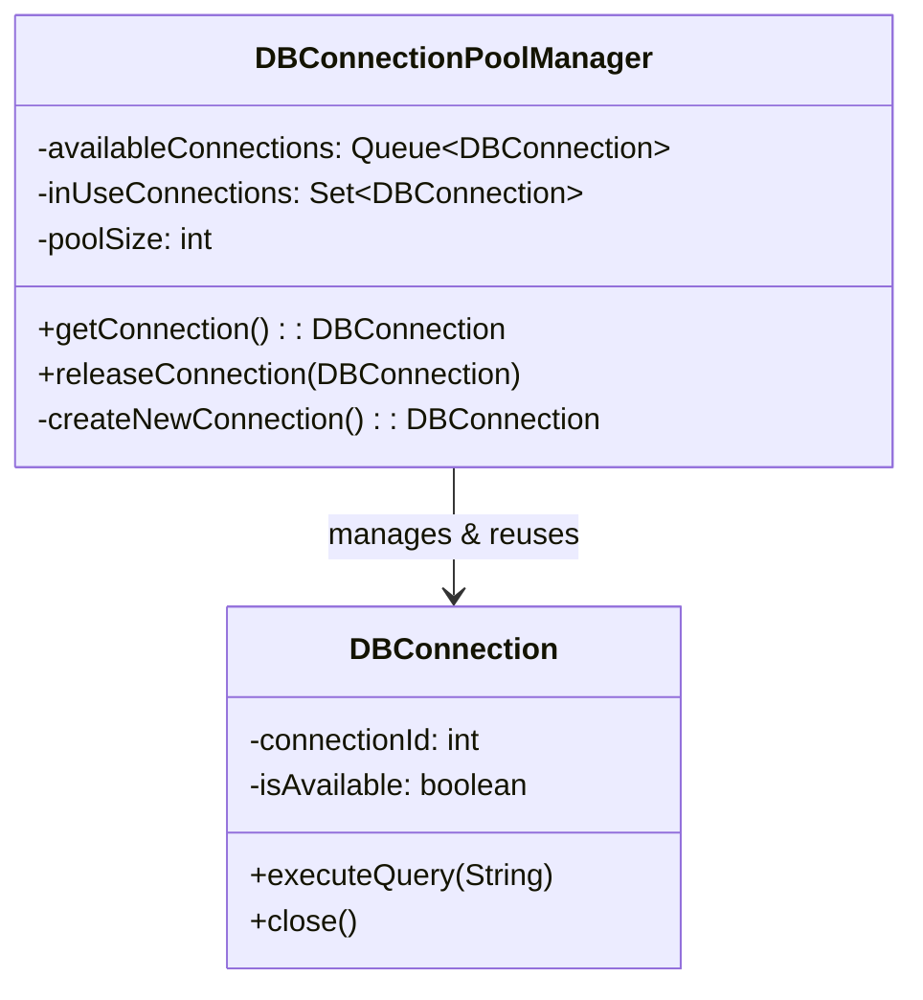

# Object Pool - Class Diagram

## Class Relationships

| Class | Responsibility | Depends On |
|-------|---|---|
| **DBConnection** | Represents a database connection that can be reused | None |
| **DBConnectionPoolManager** | Manages pool of connections, hands out and accepts returns | Creates/manages DBConnection |

## How to Code This Pattern

1. **Create Pooled Class**: `DBConnection` with proper initialization/cleanup
2. **Create Pool Manager**: `DBConnectionPoolManager` with queues for available/in-use
3. **Implement getConnection()**: Get from available pool or create new
4. **Implement releaseConnection()**: Return connection to available pool
5. **Handle Pool Exhaustion**: Either wait for available or create new (with limits)
6. **Thread Safety**: Use synchronized collections or locks
