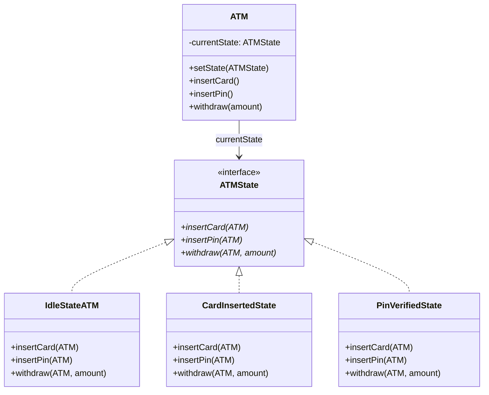

# State - Class Diagram

## Class Relationships

| Class | Responsibility | Depends On |
|-------|---|---|
| **ATMState** | Interface defining operations for a state | None |
| **IdleStateATM** | Initial state - only allows card insertion | Implements ATMState |
| **CardInsertedState** | Card inserted - only allows PIN entry | Implements ATMState |
| **PinVerifiedState** | PIN verified - only allows withdrawal | Implements ATMState |
| **ATM** | Context - delegates to current state | Holds reference to ATMState |

## How to Code This Pattern

1. **Create State Interface**: Define operations like `insertCard()`, `insertPin()`, `withdraw()`
2. **Create Concrete States**: Each state implements the interface
3. **In State Implementation**: Only allow valid operations, change ATM state accordingly
4. **Create Context (ATM)**: Maintain current state, delegate method calls to it
5. **State Transitions**: From within state methods, call `atm.setState(newState)`
6. **Invalid Operations**: Throw exception or do nothing for invalid state transitions
