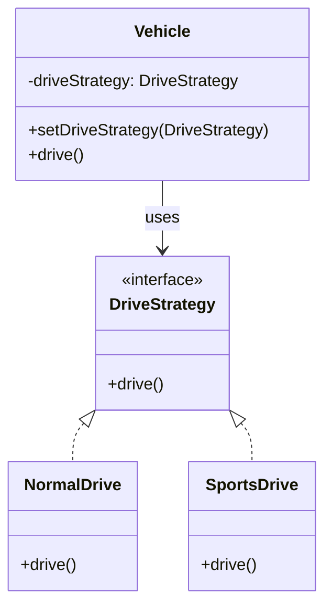

# Strategy - Class Diagram

## Class Relationships

| Class | Responsibility | Depends On |
|-------|---|---|
| **DriveStrategy** | Interface defining driving algorithms | None |
| **NormalDrive** | Concrete strategy - normal driving behavior | Implements DriveStrategy |
| **SportsDrive** | Concrete strategy - aggressive driving behavior | Implements DriveStrategy |
| **Vehicle** | Context - uses strategy to drive | Holds reference to DriveStrategy |

## How to Code This Pattern

1. **Create Strategy Interface**: Define `drive()` method
2. **Create Concrete Strategies**: `NormalDrive` and `SportsDrive`
3. **Create Context (Vehicle)**: Maintain reference to strategy
4. **Implement setDriveStrategy()**: Allow changing strategy at runtime
5. **Delegate to Strategy**: `vehicle.drive()` calls `strategy.drive()`
6. **Switch Algorithms**: Change strategy based on user input or conditions
