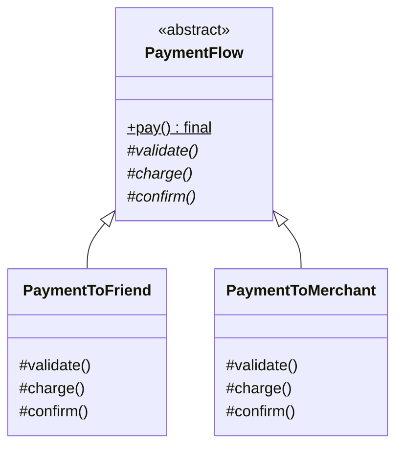

# Template Method - Class Diagram

## Class Relationships

| Class | Responsibility | Depends On |
|-------|---|---|
| **PaymentFlow** | Abstract class - defines payment algorithm skeleton (template) | None |
| **PaymentToFriend** | Concrete implementation - specific steps for friend payment | Extends PaymentFlow |
| **PaymentToMerchant** | Concrete implementation - specific steps for merchant payment | Extends PaymentFlow |

## How to Code This Pattern

1. **Create Abstract Class**: Define `pay()` as final (can't override)
2. **Define Template Method**: `pay()` calls abstract methods in order
3. **Define Abstract Methods**: `validate()`, `charge()`, `confirm()` (protected/abstract)
4. **Create Concrete Classes**: Implement abstract methods with specific logic
5. **Skeleton in Base**: Algorithm structure stays in base, details in subclasses
6. **Call Order**: Template method controls execution order, subclasses fill in steps
