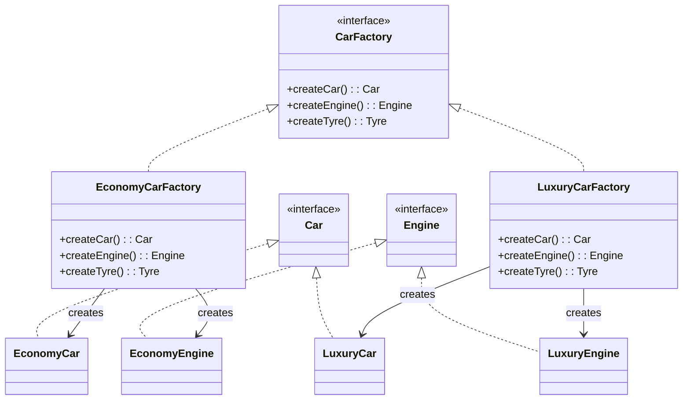

# Abstract Factory - Class Diagram

## Class Relationships

| Class | Responsibility | Depends On |
|-------|---|---|
| **CarFactory** | Abstract factory interface - declares creation methods | None |
| **EconomyCarFactory** | Creates economy family products | Creates Economy*, implements CarFactory |
| **LuxuryCarFactory** | Creates luxury family products | Creates Luxury*, implements CarFactory |
| **Car/Engine/Tyre** | Product interfaces | None |
| **Economy/Luxury variants** | Concrete products for each family | Implement product interfaces |

## How to Code This Pattern

1. **Create Abstract Factory**: Interface with methods for each product
2. **Create Product Interfaces**: `Car`, `Engine`, `Tyre`
3. **Create Concrete Products**: Economy and Luxury variants
4. **Create Concrete Factories**: Each factory creates its family
5. **Ensure Consistency**: Factory ensures related products are from same family
6. **Client Code**: Use factory interface only, don't know concrete classes
