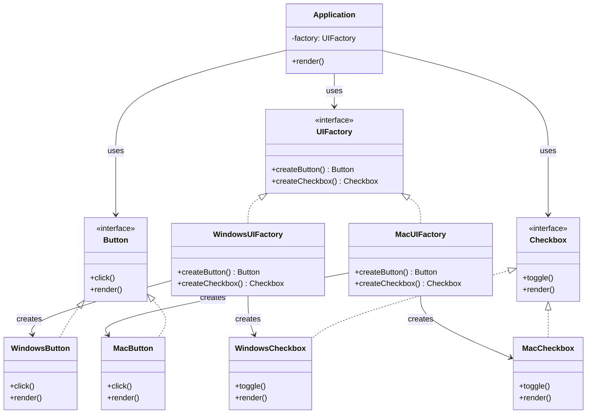

# Abstract Factory Pattern - Class Diagram



## Class Relationships

| Class | Role | Responsibility |
|-------|------|---|
| **UIFactory** | Abstract Factory | Declares methods to create product families |
| **WindowsUIFactory** | Concrete Factory | Creates Windows-specific products |
| **MacUIFactory** | Concrete Factory | Creates Mac-specific products |
| **Button** | Abstract Product | Interface for button product family |
| **WindowsButton** | Concrete Product | Windows implementation of button |
| **MacButton** | Concrete Product | Mac implementation of button |
| **Checkbox** | Abstract Product | Interface for checkbox product family |
| **WindowsCheckbox** | Concrete Product | Windows implementation of checkbox |
| **MacCheckbox** | Concrete Product | Mac implementation of checkbox |
| **Application** | Client | Uses factory to create UI components |

## Key Characteristics

1. **Factory Abstraction** - UIFactory defines contract for creating products
2. **Product Family** - Button + Checkbox work together (both Windows or both Mac)
3. **Concrete Factories** - WindowsUIFactory/MacUIFactory handle creation
4. **Concrete Products** - Platform-specific implementations (Windows/Mac)
5. **Client Decoupling** - Application doesn't know about concrete classes
6. **Consistency** - Ensures related products work together (no Mac button + Windows checkbox)

## Typical Usage Flow

```
1. Client decides which family: WindowsUIFactory or MacUIFactory
2. Client creates factory: factory = new WindowsUIFactory()
3. Client requests products: button = factory.createButton()
4. Client gets platform-specific product
5. Application uses products through abstract interfaces
```
