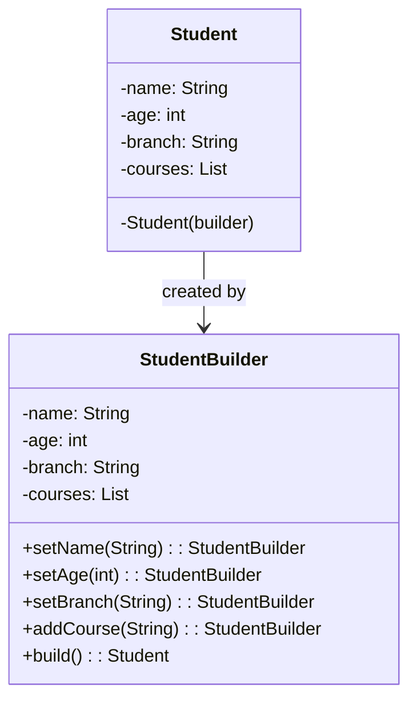

# Builder - Class Diagram

## Class Relationships

| Class | Responsibility | Depends On |
|-------|---|---|
| **Student** | Object with multiple optional fields (immutable after building) | Built by StudentBuilder |
| **StudentBuilder** | Builds Student step-by-step with fluent API | Creates Student |

## How to Code This Pattern

1. **Create Product Class**: `Student` with private constructor accepting builder
2. **Create Builder Class**: Nested static class with same fields as product
3. **Implement Fluent Methods**: Each setter returns `this` for chaining
4. **Add Defaults**: Provide sensible default values for optional fields
5. **Implement build()**: Create and return final product
6. **Usage**: `new StudentBuilder().setName("X").setAge(20).build()`
7. **Optional**: Use `@Builder` annotation from Lombok to auto-generate
