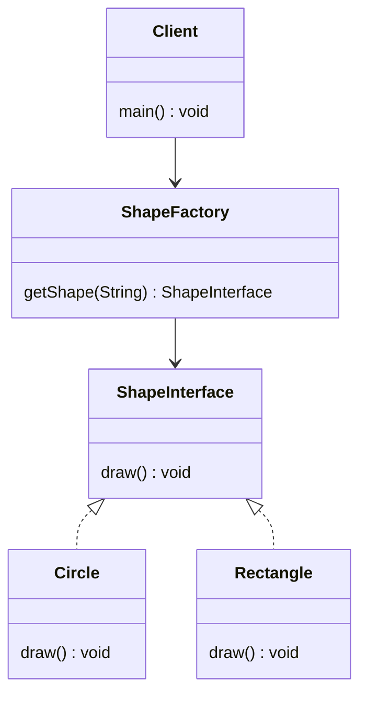

# Factory Pattern - UML Class Diagram

## Diagram Components

**ShapeInterface (Product)**
- Abstract interface that defines the contract for all shapes
- Method: `draw()`

**Concrete Products**
- `Circle`: Implements ShapeInterface, draws a circle
- `Rectangle`: Implements ShapeInterface, draws a rectangle
- `Triangle`: Implements ShapeInterface, draws a triangle

**ShapeFactory (Creator)**
- Encapsulates object creation logic
- Method: `getShape(shapeType)` - returns ShapeInterface based on type
- Eliminates the need for client code to know concrete classes

**Client**
- Uses the factory to create shapes
- Works only with ShapeInterface, not concrete implementations
- Decoupled from concrete shape classes

## Key Relationships

1. **Implements** (Dashed arrow): Concrete products implement the ShapeInterface
2. **Dependency** (Solid arrow): Factory depends on the interface to return objects
3. **Composition**: Client depends on Factory and interface, not concrete classes
