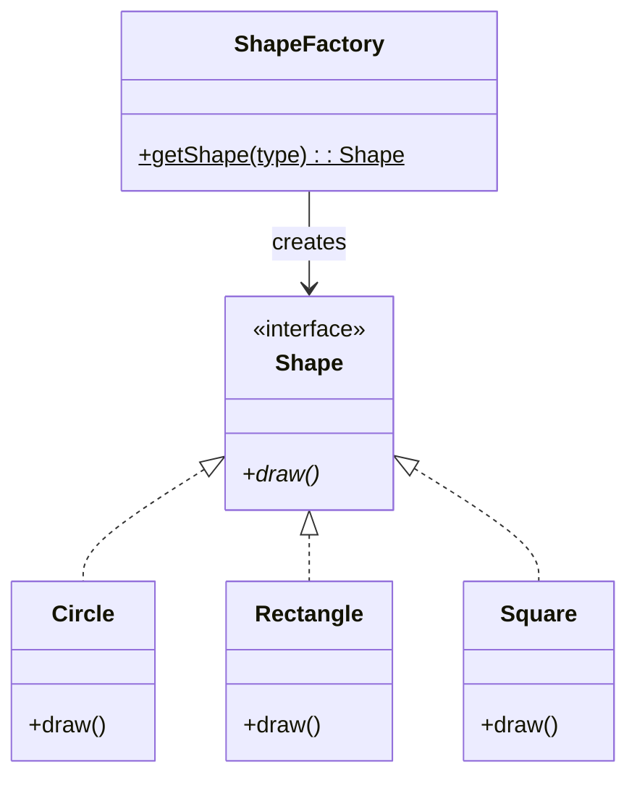

# Factory Method - Class Diagram

## Class Relationships

| Class | Responsibility | Depends On |
|-------|---|---|
| **Shape** | Product interface | None |
| **Circle/Rectangle/Square** | Concrete products | Implement Shape |
| **ShapeFactory** | Creator - factory method for creating shapes | Returns Shape interface |

## How to Code This Pattern

1. **Create Product Interface**: Define `draw()` method
2. **Create Concrete Products**: `Circle`, `Rectangle`, `Square`
3. **Create Factory Class**: Static method `getShape(String type)`
4. **Implement Factory Logic**: Switch/if-else to create right shape
5. **Return Interface**: Always return `Shape` type, not concrete class
6. **Client Usage**: `Shape shape = ShapeFactory.getShape("circle")`
7. **Encapsulate Creation**: Client doesn't know how to create shapes
