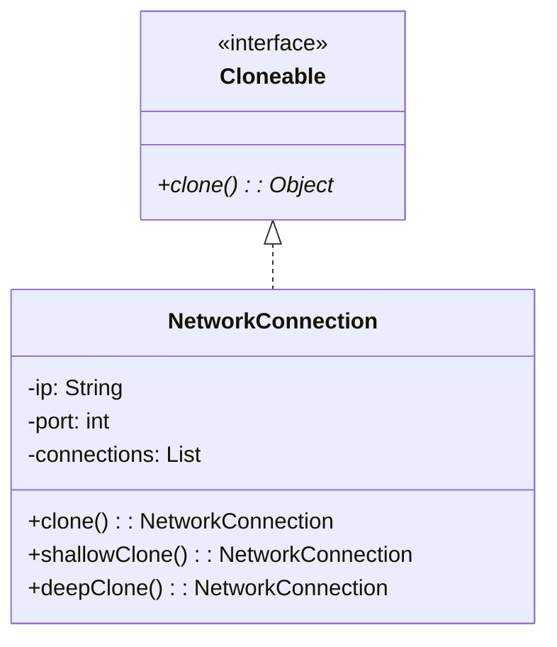

# Prototype - Class Diagram

## Class Relationships

| Class | Responsibility | Depends On |
|-------|---|---|
| **Cloneable** | Interface for cloneable objects | None |
| **NetworkConnection** | Implements cloning - supports both shallow and deep | Implements Cloneable |

## How to Code This Pattern

1. **Implement Cloneable**: Make class implement `Cloneable` interface
2. **Override clone()**: Create and return copy of object
3. **Shallow Clone**: Copy primitive fields, share reference fields
4. **Deep Clone**: Create new instances of referenced objects
5. **Handle Arrays/Lists**: Create new list and add cloned elements
6. **Catch Exception**: Catch `CloneNotSupportedException` in implementation
7. **Usage**: `NetworkConnection copy = original.clone()`
8. **Alternative**: Use copy constructor instead of `clone()`
