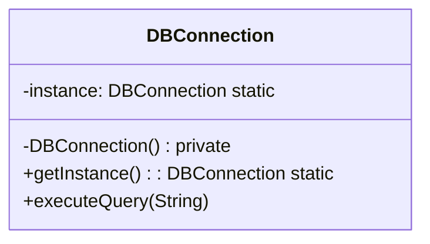

# Singleton - Class Diagram



## Class Relationships

| Class | Responsibility | Depends On |
|-------|---|---|
| **DBConnection** | Singleton - only one instance, global access | Self-manages instance |

## How to Code This Pattern

### Eager Initialization (Thread-Safe)
```java
class DBConnection {
    private static final DBConnection instance = new DBConnection();
    
    private DBConnection() { }
    
    public static DBConnection getInstance() {
        return instance;
    }
}
```

### Lazy Initialization (Thread-Safe)
```java
class DBConnection {
    private static DBConnection instance;
    
    private DBConnection() { }
    
    public static synchronized DBConnection getInstance() {
        if (instance == null) {
            instance = new DBConnection();
        }
        return instance;
    }
}
```

### Double-Checked Locking
```java
class DBConnection {
    private static volatile DBConnection instance;
    
    private DBConnection() { }
    
    public static DBConnection getInstance() {
        if (instance == null) {
            synchronized(DBConnection.class) {
                if (instance == null) {
                    instance = new DBConnection();
                }
            }
        }
        return instance;
    }
}
```

## Key Points

- **Private Constructor**: Prevent instantiation from outside
- **Static Instance**: Hold single instance
- **getInstance()**: Return the singleton instance
- **Thread-Safe**: Use synchronized or volatile for concurrency
- **Enum Alternative**: Use enum for automatic singleton
